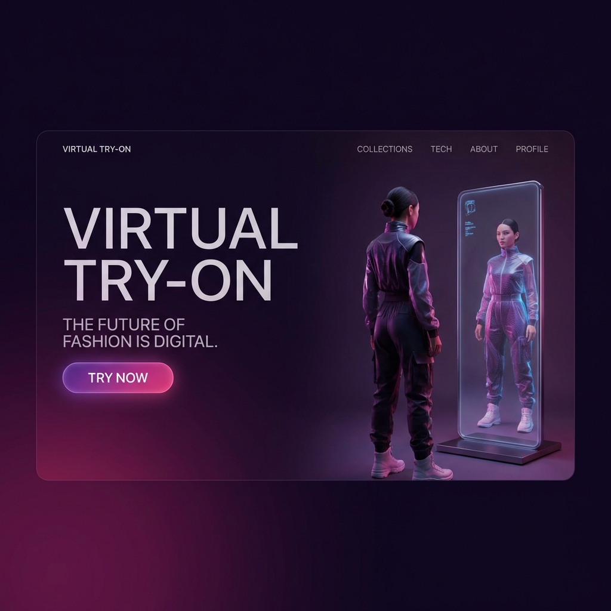
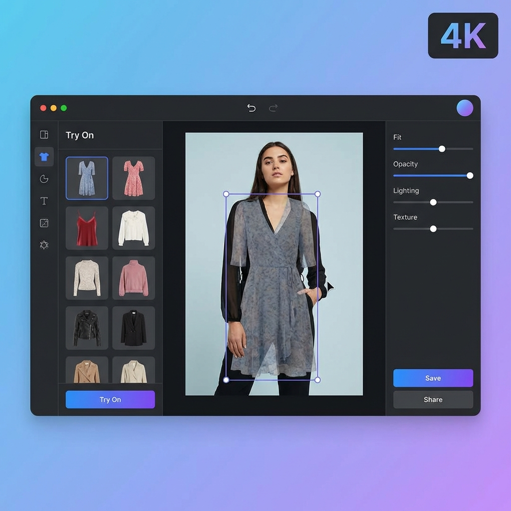

# Virtual Try-On Demo

[🔴 **LIVE DEMO**](https://virtual-tryon-demo.vercel.app)



## 📖 Project Description

**Virtual Try-On Demo** is a full-stack web application designed to demonstrate a modern, interactive fashion experience. It allows users to upload their own photos and overlay high-quality clothing items to visualize how they look.

The project features a premium, responsive UI with a focus on user experience, built using **Next.js 14** for the frontend and **FastAPI** for robust backend image processing.

## ✨ Features

-   **Interactive Try-On Editor**: Upload your photo and overlay outfits.
-   **Gesture Controls**: Drag, resize, rotate, and flip clothing items to get the perfect fit.
-   **Dynamic Catalog**: Browse a curated selection of tops, dresses, jackets, and skirts.
-   **High-Quality Rendering**: Backend-powered image composition using standard Python libraries (Pillow) avoids client-side artifacts.
-   **Responsive Design**: Fully functional on mobile and desktop devices.
-   **Downloadable Results**: Save your try-on creations directly to your device.



## 🛠️ Tech Stack

### Frontend
-   **Framework**: Next.js 14 (App Router)
-   **Language**: TypeScript
-   **Styling**: Tailwind CSS
-   **State Management**: React Hooks

### Backend
-   **Framework**: FastAPI (Python)
-   **Image Processing**: Pillow (PIL)
-   **Server**: Uvicorn

## 🚀 How to Run

### Prerequisities
-   Node.js (v18+)
-   Python (v3.9+)

### 1. Backend Setup
```bash
cd backend
python -m venv venv
source venv/bin/activate  # Windows: venv\Scripts\activate
pip install -r requirements.txt
uvicorn main:app --reload --port 8000
```

### 2. Frontend Setup
```bash
cd frontend
npm install
npm run dev
```
Open [http://localhost:3000](http://localhost:3000) to view the app.

## 💡 Skills Used

-   **Full-Stack Development**: Integrating specialized Python backend services with a modern React frontend.
-   **System Architecture**: Designing a decoupled architecture deployable to serverless (Vercel) and containerized (Render) environments.
-   **Image Processing**: Implementing coordinate-mapping logic to preserve high-resolution rendering while offering lower-res interactive previews.
-   **UX/UI Design**: Creating a "luxury fashion" aesthetic using Tailwind CSS utility classes and gradients.
-   **State Management**: Handling complex transformation state (rotation, scale, position) across components.

---
*Built by Sidrah via Antigravity*
